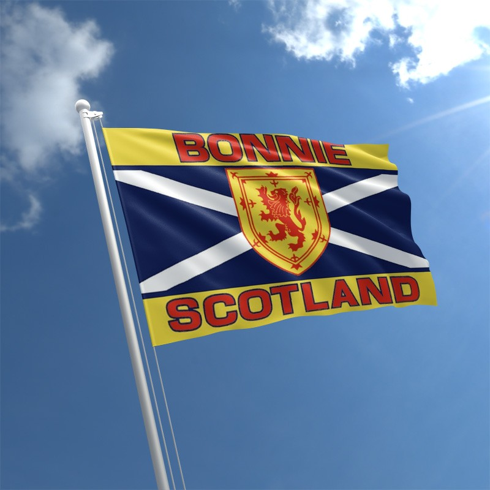

# Reflections
I could feel myself drifting into that dangerous position where only reinforced
matchsticks would keep my eyelids from shutting. How is it even physically possible that
something as featherweight as eyelashes and a little bit of skin can be a ton weight? This eyelid
workout is fine if you’re lying in bed watching the telly. Far from fine if you’re behind the
wheel of a car whizzing past Glasgow Airport on the M8. Why I hadn’t left earlier to miss the
rush hour traffic is anyone’s guess. Flying up would’ve been even more sensible but hey ho.
I was on the last leg of my four hundred mile journey from my home in Wiltshire to my parent’s
house in Bonnie Scotland.

“I know it’s short notice Kristina but Ann and Herman are staying with us this weekend
and we thought you might like to come and meet up with them. Do you remember them?”
“Is that the mother and son who you knew when we lived in Holland?”
“That’s right. I think the last time you’d have seen them you’d have been about thirteen.
Remember we went over for a visit and you had a crush on Herman? He used to take you out
on the back of his moped.” I could only pray that Herman would not also remember my teenage
infatuation.
Less than forty-eight hours later I removed the matchsticks from my eyes as I pulled on
to their drive. A sneaky look in the rearview mirror to check that I didn’t look as tired and
puffy-eyed as I felt. That wouldn’t make the best first impression on Herman.
Just to be on the safe side, I also glanced down at my chest to double-check that my
hammering heart was not visible through my blouse. Then adopting the most casual demeanour
I could muster I opened the front door and was greeted by the warm embrace of my mum.
Glancing over her shoulder I spied a tall, dark-haired, very slim man rise up out of his seat and
head in my direction. It was ‘him.’
“Hello, Kristina. It’s great to see you,” said Herman as he kissed me on both cheeks.
“It’s lovely to see you too. I was trying to think back to when we last saw each other
but have no idea. Can you remember how long it’s been?” I knew exactly how long it had
been, but I didn’t want to give him the satisfaction of knowing I’d even thought about it.
The weekend flew by. The majority of it was spent in the company of our families, but
on Saturday night we stayed up late, just the two of us, chatting away into the early hours. 
“What is it you do for a job Kristina? I was asking your Dad last night before you
arrived but he wasn’t giving much away.”
“I have my own freelance recruitment business. So, for example, my last assignment
was working for AXA, the insurance company, recruiting their graduate intake for the year. I
absolutely love it although, as you might have gathered from my Dad’s response, it’s not a
business he approves of.”
“I didn’t like to say but yeah I certainly got that impression. I’ve also got my own
computer retail business which I started just over five years ago.”
“Bet my Dad approves of that?”
“He was certainly asking me loads of questions about it. Changing the subject I haven’t
heard you mention a partner. Are you in a relationship?”
I could feel myself blushing. “No, I’ve given relationships up as a bad idea. I’ve come
to the conclusion that either I’m crap at them or there are no decent men out there.” I replied
with a nervous laugh. “How about you? Do you have a girlfriend?”
“No, not at the moment.” Hindsight would teach me to question the exact definition of
‘moment’.
Although neither of us voiced it, that weekend a spark was ignited. What a romantic
love story this would make; a girl and a boy who have known each other all their lives; who’d
had a teenage crush before being parted for twenty years; fate bringing them back together.
When Herman returned to Holland, we continued chatting, first by email and then by
phone. The chats became flirtier, each testing the water with the other.
“It’s your birthday next month. Would you let me treat you to a trip over to Amsterdam
so I can spoil you for a few days?”
“Ooh, I think I could be persuaded” I replied, trying to play it cool but inside my tummy
was doing somersaults.
If this love story has a happy ending Richard Curtis will be knocking at my door
begging for the film rights, I thought to myself.

